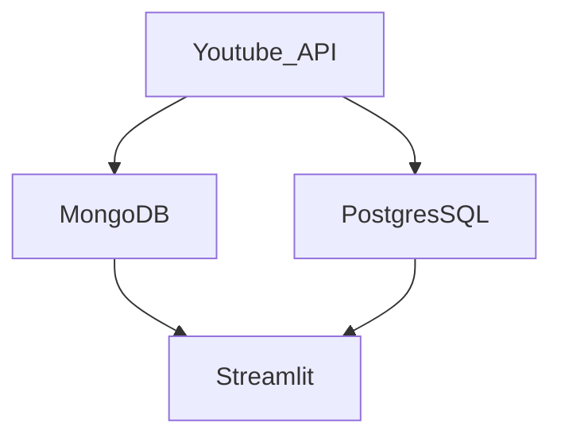

# YouTube Data Harvesting and Warehousing
Capstone Project Assigned by Guvi Institute.

 

```
Streamlit application that allows users to access and analyze data from multiple YouTube channels.
```


 ## Features :
- [x] Able to input a YouTube channel ID and retrieve all the relevant data (Channel name, subscribers, total video count, playlist ID, video ID, likes,dislikes, comments of each video) using Google API.
  
- [x] Option avaialable to store the data in a MongoDB database as a data lake.

- [x]  Able to collect data for up to 10 different YouTube channels and store them in the data lake by clicking a upload button.
  
- [x]  Option available to select a channel name and migrate its data from the data lake to a SQL database as tables.

 - [x] Able to search and retrieve data from the SQL database using different search options, including joining tables to get channel details.

## Tools and libraries used for this project :

| Tool/Lib | Purpose |
| --- | --- |
| Python | Scripting,  to make requests to the API for retrieve datas. |
| MongoDB | To store the retrieved datas in a MongoDB data lake |
| PostgresSQL | Migrate to a SQL data warehouse for converting as structured/tabular format. |
| Streamlit | Using Streamlit to create a simple UI where users can enter a YouTube channel ID, view the channel details, and select channels to migrate to the data warehouse. |
| Pandas | For EDA processes. |
| Plotly | Graphing library makes interactive, publication-quality graphs. |

## Approach :


## User Interface 
__Home Page__

> About this Application and benefits of Youtube data harvesting


__Upload Page__

> Upload Youtube channel's Identity Document to retrieve datas and store it in a MongoDB database.


__Migrate Page__

> Insert the retrieved datas into SQL Data Warehouse 


__Analysis Page__

> Select the Questions to insights of youtube channels


__Visualization__

> Visualization with Plotly charts and graphs to help users analyze the data.


## Conclusion
> This project aims to develop a user-friendly Streamlit application that utilizes the
Google API to extract information on a YouTube channel, stores it in a MongoDB
database, migrates it to a SQL data warehouse, and enables users to search for
channel details and join tables to view data in the Streamlit app.
